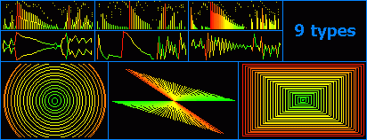



## Advanced Visualization

### Description

This is probably one of the best visualizations on PSC. This project doesn't uses any other dlls or ocx. I made this project as ActiveX

so it can be easly use in any kind of player.

It draws 9 types of visualization by reading 50 frequencys. You can set background, draw color, peaks color, also you can set gradient

colors.

I accept any comments, ideas and votes.
 
### More Info
 

             |
---                |---
**Submitted On**   |2002-02-02 15:39:10
**By**             |[Dalibor Kopjar](https://github.com/Planet-Source-Code/PSCIndex/blob/master/ByAuthor/dalibor-kopjar.md)
**Level**          |Advanced
**User Rating**    |4.5 (68 globes from 15 users)
**Compatibility**  |VB 5\.0, VB 6\.0
**Category**       |[Graphics](https://github.com/Planet-Source-Code/PSCIndex/blob/master/ByCategory/graphics__1-46.md)
**World**          |[Visual Basic](https://github.com/Planet-Source-Code/PSCIndex/blob/master/ByWorld/visual-basic.md)
**Archive File**   |[Advanced\_V52430222002\.zip](https://github.com/Planet-Source-Code/dalibor-kopjar-advanced-visualization__1-31420/archive/master.zip)

